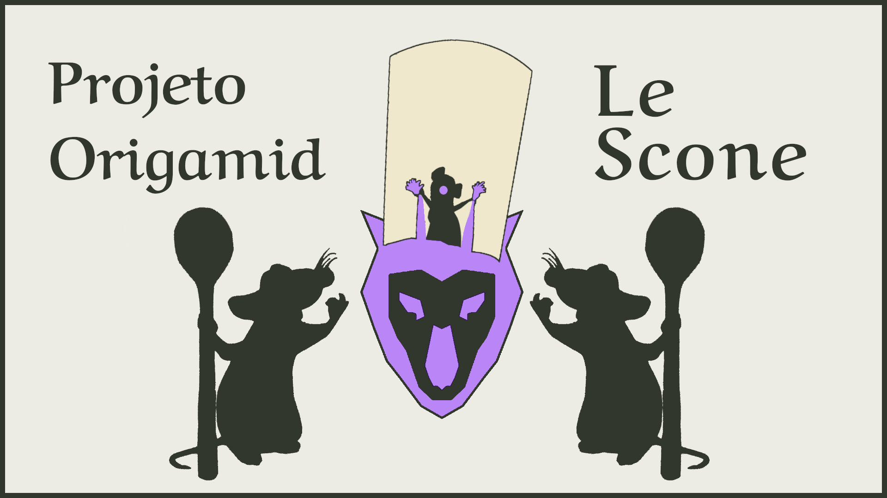
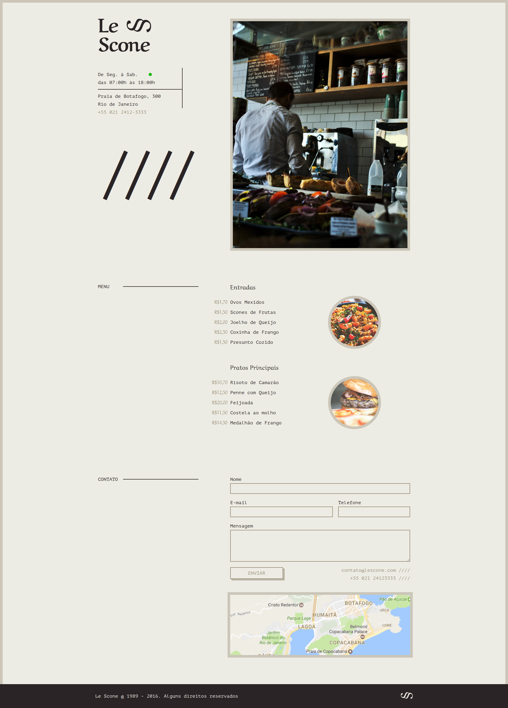

# Projeto Le Scone

Esse repositório tem como objetivo mostrar mais um dos trabalhos desenvolvidos em cursos. Essa landing page com temática de cardápio de restaurante do repositório foi desenvolvido no curso de CSS com SASS, que é centrado em desenvolver conhecimentos relativos ao SASS(Sintactically Awesome Style Sheets) que se trata de um pré-processador que converte os arquivos com extensão ".scss" em ".css".

Conhecimentos aprendidos foram:

- Funções
- Mixins
- Extend
- Operadores
- Loops
- Entre outros

> O Projeto Le Scone
> 
